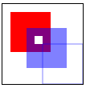

## 1. Canvas基本用法

使用 `<canvas>` 元素，必须先设置其 width 和 height 属性，指定可以绘图的区域大小。出现在开始和结束标签中的内容是后备信息，如果浏览器不支持 `<canvas>` 元素，就会显示这些信息。如果不任何样式或者不绘制任何图形，在页面中是看不到该元素的。

```
<canvas id="drawing" width="200px" height="200px">A drawing of something.</canvas>
```

要再 canvas 上绘图，需要取得绘图上下文。而取得绘图上下文对象的引用，需要调用 getContext() 方法并传入上下文的名字。传入 '2d'，上就可以取得 2D 上下文对象

- toDataURL() 方法可以取得在 `<canvas>`元素上绘制的图像。接受一个参数：图像的 MIME 类型格式，而且适用于创建图像的任何上下文，默认情况下值为 'image/png'，也可以传入 'image/jpg'

```
var drawing = docuement.getElementById('drawing');

// 确定浏览器支持<canvas>元素
if(drawing.getContext){
	var context = drawing.getContext('2d');

	// 显示图像
	var imgURL = drawing.toDataURL('image/png');

	var image = new Image();
	image.src = imgURL;
	document.body.appendChild(image);
}
```

> IE9+、Firefox 1.5+、Safari 2+、Opera 9+、Chrome、IOS 版 safari 以及 Android 版 Webkit 都在某种程度上支持 `<canvas>`

## 2. 2D 上下文

**2D 上下文的坐标开始于 `<canvas>` 元素的左上角，原点坐标是(0,0)。所有坐标值都是基于这个原点计算， x 值越大表示越靠右，y 值越大表示越靠下**

### 2.1. 填充和描边

2D 上下文的两种基本绘图操作是填充和描边。填充，用指定的样式（颜色、渐变或图像）填充图形；描边，只在图形的边缘画线。     
这两个操作的结果取决于两个属性：fillStyle 和 strokeStyle，这两个属性的值可以是字符串、渐变对象或模式对象，而且它们的默认值都是"#000000"。

***如果指定为字符串，可以使用 CSS 中指定颜色值的任何格式，包括颜色名、十六进制码、rgb、rgba、hsl 或 hsla***

### 2.2. 绘制矩形

- fillRect() 方法在画布上绘制的矩形会填充指定的颜色，填充的颜色通过 fillStyle 属性指定
- strokeRect() 方法在画布上绘制的矩形会使用指定的颜色描边，描边颜色通过 strokeStyle 属性指定
- clearRect() 方法用于清楚画布上的矩形区域，本质上，这个方法可以吧绘制上下文中的某一矩形区域变透明

**上面三个方法都接受4个参数：矩形的 x 坐标、矩形的 y 坐标、矩形的宽度和矩形的和高度，这些参数的单位都是像素**

2D 上下文还含有一下3个属性:

- lineWidth: 控制线条的宽度，值可以是任意整数
- lineCap: 控制线条末端的形状是平头、圆头还是方头（'butt'、'round'或'square'）
- lineJoin: 控制线条相交的方法是圆交、斜交还是斜接（'round'、'bevel'或'miter'）

```
<canvas width="100px" height="100px">A drawing of something.</canvas>

var drawing0 = document.querySelectorAll('canvas')[0];
if(drawing0.getContext){
	var context = drawing0.getContext('2d');

	context.fillStyle = '#ff0000';
	context.fillRect(10, 10, 50, 50);
	context.fillStyle = 'rgba(0, 0, 255, 0.5)';
	context.fillRect(30, 30, 50, 50);
	context.strokeStyle = 'rgba(0, 0, 255, 0.5)';
	context.strokeRect(50, 50, 50, 50);

	context.clearRect(40, 40, 10, 10);
}
```

