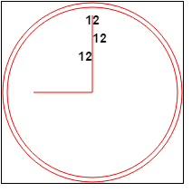
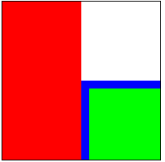
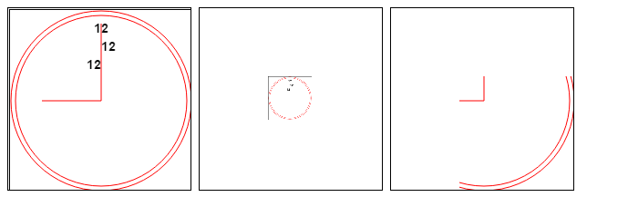
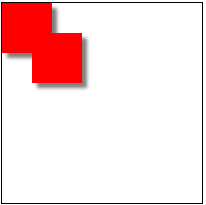
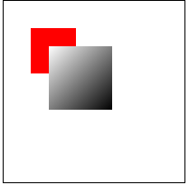

## 1. Canvas基本用法

使用 `<canvas>` 元素，必须先设置其 width 和 height 属性，指定可以绘图的区域大小。出现在开始和结束标签中的内容是后备信息，如果浏览器不支持 `<canvas>` 元素，就会显示这些信息。如果不任何样式或者不绘制任何图形，在页面中是看不到该元素的。

```
<canvas id="drawing" width="200px" height="200px">A drawing of something.</canvas>
```

要再 canvas 上绘图，需要取得绘图上下文。而取得绘图上下文对象的引用，需要调用 getContext() 方法并传入上下文的名字。传入 '2d'，上就可以取得 2D 上下文对象

- toDataURL() 方法可以取得在 `<canvas>`元素上绘制的图像。接受一个参数：图像的 MIME 类型格式，而且适用于创建图像的任何上下文，默认情况下值为 'image/png'，也可以传入 'image/jpg'

```
var drawing = docuement.getElementById('drawing');

// 确定浏览器支持<canvas>元素
if(drawing.getContext){
	var context = drawing.getContext('2d');

	// 显示图像
	var imgURL = drawing.toDataURL('image/png');

	var image = new Image();
	image.src = imgURL;
	document.body.appendChild(image);
}
```

> IE9+、Firefox 1.5+、Safari 2+、Opera 9+、Chrome、IOS 版 safari 以及 Android 版 Webkit 都在某种程度上支持 `<canvas>`

## 2. 2D 上下文

**2D 上下文的坐标开始于 `<canvas>` 元素的左上角，原点坐标是(0,0)。所有坐标值都是基于这个原点计算， x 值越大表示越靠右，y 值越大表示越靠下**

### 2.1. 填充和描边

2D 上下文的两种基本绘图操作是填充和描边。填充，用指定的样式（颜色、渐变或图像）填充图形；描边，只在图形的边缘画线。     
这两个操作的结果取决于两个属性：fillStyle 和 strokeStyle，这两个属性的值可以是字符串、渐变对象或模式对象，而且它们的默认值都是"#000000"。

***如果指定为字符串，可以使用 CSS 中指定颜色值的任何格式，包括颜色名、十六进制码、rgb、rgba、hsl 或 hsla***

### 2.2. 绘制矩形

- fillRect() 方法在画布上绘制的矩形会填充指定的颜色，填充的颜色通过 fillStyle 属性指定
- strokeRect() 方法在画布上绘制的矩形会使用指定的颜色描边，描边颜色通过 strokeStyle 属性指定
- clearRect() 方法用于清楚画布上的矩形区域，本质上，这个方法可以吧绘制上下文中的某一矩形区域变透明

**上面三个方法都接受4个参数：矩形的 x 坐标、矩形的 y 坐标、矩形的宽度和矩形的和高度，这些参数的单位都是像素**

2D 上下文还含有一下3个属性:

- lineWidth: 控制线条的宽度，值可以是任意整数
- lineCap: 控制线条末端的形状是平头、圆头还是方头（'butt'、'round'或'square'）
- lineJoin: 控制线条相交的方法是圆交、斜交还是斜接（'round'、'bevel'或'miter'）

```
<canvas width="100px" height="100px">A drawing of something.</canvas>

<script type="text/javascript">
var drawing0 = document.querySelectorAll('canvas')[0];
	if(drawing0.getContext){
		var context = drawing0.getContext('2d');

		context.fillStyle = '#ff0000';
		context.fillRect(10, 10, 50, 50);
		context.fillStyle = 'rgba(0, 0, 255, 0.5)';
		context.fillRect(30, 30, 50, 50);
		context.strokeStyle = 'rgba(0, 0, 255, 0.5)';
		context.strokeRect(50, 50, 50, 50);

		context.clearRect(40, 40, 10, 10);
	}
</script>
```


### 2.3. 绘制路径

- beginPath() 方法表示开始绘制新路径，要绘制路径必须调用该方法
- closePath() 方法表示把绘制路径的终点与起点连接起来
- fill() 方法表示绘制路劲完成后，填充它。在这方法之前需要使用 fillStyle 属性指定填充颜色
- stroke() 方法对路劲描边。调用这个方法之前需要使用 strokeStyle 属性指定描边的颜色
- clip() 方法在路劲上创建一个剪切区域
- isPointInPath(x, y) 方法用于在路劲被关闭之前确定画布上的(x, y)坐标是否在路劲上，返回布尔值

绘制路径的方法如下:      
- arc(x, y, radius, startAngle, endAngle, countercolockwise): 以(x, y)为圆心绘制一条弧线，弧线半径为 radius，起始和结束角度（用弧度表示）分别为 startAngle 和 endAngle。最后一个参数表示 startAngle 和 endAngle 是否按逆时针方向计算，值为 false 表示按顺时针方向计算
- arcTo(x1, y1, x2, y2, radius): 从上一点开始绘制一条弧线，到(x2, y2)位置，并且以给定的半径 radius 穿过(x1, y1)
- bezierCurveTo(c1x, c1y, c2x, c2y, x, y): 从上一点开始绘制一条曲线，到(x, y)为止，并且以(c1x, c1y)和(c2x, c2y) 为控制点
- lineTo(x, y): 从上一点开始绘制一条直线，到(x, y)为止
- moveTo(x, y): 将绘图游标移动到(x, y)，不画线
- quadraticCurveTo(cx, cy, x, y): 从上一点开始绘制一条二次曲线，到(x, y)为止，并且以(cx, cy)作为控制点
- rect(x, y, width, height): 从(x, y)开始绘制一个矩形，宽度和高度分别有 width 和 height 指定。这个方法绘制的是矩形路径，而不是 strokeRect() 和 fillRect() 所绘制的独立的形状

### 2.4. 绘制文本

**2D 上下文绘制文本主要使用下面两个方法:**

- fillText() 
- strokeText() 

这两个方法接收 4 个参数： 要绘制的文本字符串、x 坐标、y 坐标和可选的最大像素宽度

- measureText() 方法利用 font 、textAlign 和 textBaseline 的当前值计算指定文本的大小。该方法接收一个参数，即要绘制的文本

```
// 在一个 140 像素宽的矩形区域中绘制文本 Hello world!，下面的代码从 100 像素的字体大小开始递减，最终会找到合适的字体大小
var fontSize = 100;
context.font = fontSize + 'px Arial';

while(context.measureText('Hello world!').width > 140){
	fontSize--;
	context.font = fontSize + 'px Arial';
}

context.fillText('Hello world', 10, 10);
context.fillText('Font size is' + fontSize + 'px', 10, 50);
```

**上述两个方法都以下列 3 个属性为基础：**
- font: 表示文本样式、大小及字体，用 CSS 中指定字体个格式来指定，例如"10px Arial"
- textAlign: 表示文本对齐方法。可能的值有"start"、"end"、"left"、"right"和"center"
- textBaseline: 表示文本的基线。可能的值有"top"、"hanging"、"middle"、"alphabetic"、"ideographic"和"bottom"


```
<canvas width="200px" height="200px">A drawing of something.</canvas>

<script type="text/javascript">
	var drawing0 = document.querySelectorAll('canvas')[0];
	if(drawing1.getContext){
		var context = drawing1.getContext('2d');

		context.beginPath();

		// 绘制外圆
		// context.lineTo(100, 100);
		// canvas 起始的坐标为中心，下面绘制的圆会把左边制动移动到，右边边框的中点上
		context.arc(100, 100, 99, 0, 2 * Math.PI, false);

		// 绘制内圆
		// 内圆需要把路径移动到内圆上的某一点，以避免绘制出多余的线条
		context.moveTo(194, 100);
		context.arc(100, 100, 94, 0, 2 * Math.PI, false);

		// 绘制分针
		context.moveTo(100, 100);
		context.lineTo(100, 15);

		// 绘制时针
		context.moveTo(100, 100);
		context.lineTo(35, 100);


		// context.lineTo(35, 100);
		// context.moveTo(0, 0);
		// context.arcTo(0, 10, 200, 0, 5);

		// context.lineWidth = '5';

		// context.lineCap = 'square';

		// context.lineJoin = 'bevel';

		// context.closePath();

		// 描边路径
		context.strokeStyle = 'red';
		context.stroke();

		
		context.font = 'bold 14px Arial';
		context.textAlign = 'center';
		context.textBaseline = 'middle';
		context.fillText('12', 100, 20);

		// 起点对齐
		context.textAlign = 'start';
		context.fillText('12', 100, 40);

		// 终点对齐
		context.textAlign = 'end';
		context.fillText('12', 100, 60);

		if(context.isPointInPath(100, 100)){
			console.log('Point(100, 100) in the path');
		};
	}
}
</script>
```



### 2.5. 变换

- rotate(angle): 围绕原点旋转图像 angle 弧度
- scale(scaleX, scaleY): 缩放图像，在 x 方向乘以 scaleX ，在 y 方向乘以 scaleY. scaleX 和 scaleY 的默认值都是 1.0
- translate(x, y): 将坐标原点移动到(x, y)。执行这个变换之后，坐标 (0,0) 会变成之为由 (x,y) 表示的点
- tramsoform(m1_1, m1_2, m2_1, m2_2, dx, dy): 直接修改变换矩阵
- setTransform(m1_1, m1_2, m2_1, m2_2, dx, dy): 将变换矩阵重置为默认状态，然后再调用 transform()

- save() 方法把当时的所有设置都保存进入一个栈解构
- restore() 方法在保存设置的栈结构中向前返回一级，恢复之前的状态。如果连续调用 restore() 则可以一级一级返回

```
<canvas width="200px" height="200px">A drawing of something.</canvas>

<script type="text/javascript">
	var drawing = document.querySelectorAll('canvas')[0];
	if(drawing.getContext){
		let context = drawing.getContext('2d');

		context.fillStyle = '#ff0000';
		context.save();

		context.fillStyle = '#00ff00';
		context.translate(100, 100);
		context.save();

		context.fillStyle = '#0000ff';
		context.fillRect(0, 0, 100, 200);

		context.restore();
		context.fillRect(10, 10, 100, 200);

		context.restore();
		context.fillRect(0, 0, 100, 200);
	}
</script>
```



### 2.6. 绘制图像

使用 drawImage() 方法可以把一副图像绘制到画布上，该方法可以使用三种不同的参数组合

> 除了给 drawImage() 方法传入 HTML 的 `` 元素外，还可以传入另一个 `<canvas>` 元素作为其第一个参数。如果图片来自不同域，使用 toDataURL() 方法会抛出一个错误，被认为 "不干净"，因而会抛出错误

```
// 传入一个  元素，把它绘制在上下文中，起点为(10,10)
var image = document.images[0];
context.drawImage(image, 10, 10);

// 传入一个  元素，把它绘制在上下文中，起点为(10,10)，图像大小为 20 x 30 像素
context.drawImage(image, 50, 10, 20, 30);

// 9个参数分别为： 要绘制的图像、源图像的 x 坐标、源图像的 y 坐标、源图像的宽度、源图像的高度、目标图像的 x 坐、目标图像的 y 坐标、目标图像的宽度、目标图像的高度。下面一行代码解析为，原始图像的这个部分的起点为(0, 10)，宽和高都是50像素，最终绘制到上下文中的图像的起点是(0,100)，而大小变成了 40 x 60 像素
context.drawImage(image, 0, 10, 50, 50, 0, 100, 40, 60);


var drawing3 = document.querySelectorAll('canvas')[3];
if(drawing3.getContext){
	let context = drawing3.getContext('2d');
	var img = new Image();
	img.onload = function(){
		context.drawImage(img, 0, 0);
	}
	img.src = './image/20161229165543.png';
}

var drawing4 = document.querySelectorAll('canvas')[4];
if(drawing4.getContext){
	let context = drawing4.getContext('2d');
	let img = new Image();
	img.onload = function(){
		context.translate(75, 75);
		context.drawImage(img, 0, 0, 50, 50);
	}
	img.src = './image/20161229165543.png';
}

var drawing5 = document.querySelectorAll('canvas')[5];
if(drawing5.getContext){
	let context = drawing5.getContext('2d');
	let img = new Image();
	img.onload = function(){
		context.translate(75, 75);
		context.drawImage(img, 75, 75, 200, 200, 0, 0, 200, 200);
	}
	img.src = './image/20161229165543.png';
}
```



### 2.7. 阴影

2D 上下文会根据以下几个属性的值，自动为形状或路径绘制出阴影

- shadowColor: 用 CSS 颜色格式表示的阴影颜色，默认为黑色
- shadowOffsetX: 形状或路径 x 轴方向的阴影偏移量，默认为 0
- shadowOffsetY: 形状或路径 y 轴方向的阴影偏移量，默认为 0
- shadowBlue: 模糊的像素数，默认 0 ，即不模糊

```
var drawing6 = document.querySelectorAll('canvas')[6];
if(drawing6.getContext){
	let context = drawing6.getContext('2d');
	context.shadowOffsetX = 5;
	context.shadowOffsetY = 5;
	context.shadowBlur = 4;
	context.shadowColor = 'rgba(0, 0, 0, 0.5)';

	context.fillStyle = '#ff0000';
	context.fillRect(0, 0, 50, 50);

	context.fiilStyle = 'rgba(0, 0, 255, 1)';
	context.fillRect(30, 30, 50, 50);
}
```



### 2.8. 渐变

#### 线性渐变

- createLinearGradient() 方法可以创建一个新的线性渐变，该方法接收4个参数：起点的 x 坐标、起点的 y 坐标、终点的 x 坐标、终点的 y 坐标。条用这个方法会创建一个指定大小的渐变，并返回 CanvasGradient 对象的实例

- addColorStop() 方法在创建渐变对象后使用来指定色标，这个方法接收两个参数：色标位置和 CSS 颜色值。色标位置是一个 0 (开始的颜色)到 1 (结束的颜色)之间的数字

> 需要注意确保渐变与形状对齐，有时可能会导致矩形只显示一部分渐变效果，渐变不均匀

```
// 使用下面的计算函数可以确保坐标合适
function createRectLinearGradient(context, x, y, width, height){
	return context.createRectLinearGradient(x, y, x + width, y + height);
}

var drawing7 = document.querySelectorAll('canvas')[7];
if(drawing7.getContext){
	let context = drawing7.getContext('2d');

	context.fillStyle = '#ff0000';
	context.fillRect(30, 30, 50, 50);

	let gradient = createRectLinearGradient(context, 50, 50, 70, 70);

	gradient.addColorStop(0, 'white');
	gradient.addColorStop(1, 'black');

	context.fillStyle = gradient;
	context.fillRect(50, 50, 70, 70);
}
```

;

#### 径向渐变

- createRadialGradient() 方法可以创建一个新的径向渐变，该方法接收6个参数：前三个参数指定的是起点圆的原心(x 和 y)及半径，后三个参数指定的是终点圆的原心(x 和 y)及半径

```
var drawing8 = document.querySelectorAll('canvas')[8];
if(drawing8.getContext){
	let context = drawing8.getContext('2d');

	let gradient = context.createRadialGradient(100, 100, 30, 100, 100, 100);

	gradient.addColorStop(0, 'white');
	gradient.addColorStop(1, 'black');

	context.fillStyle = gradient;
	context.fillRect(0, 0, 200, 200);
}
```

### 2.9.模式

- createPattern() 方法可以创建一个新模式，可以用来填充或描边图形，该方法接收两个参数：一个 HTML `` 元素和一个表示如何重复图像的字符串，第二个参数的值与 CSS 的 background-repeat 属性值相同，包括'repeat'、'repeat-x'、'repeat-y'和'no-repeat'

```
var drawing9 = document.querySelectorAll('canvas')[9];
if(drawing9.getContext){
	let context = drawing9.getContext('2d');
	let image = new Image();
	image.onload = function(){
		let pattern = context.createPattern(image, 'repeat');
		context.fillStyle = pattern;
		context.fillRect(10, 10, 150, 150);
	}
	image.src = './image/20161229165543.png';
}
```

> createPattern() 方法的第一个参数也可以是一个 `<video>` 元素，或者另一个 `<canvas>` 元素

### 2.10.使用图像数据

- getImageData() 方法用来取得原始图像数据，该方法接收4个参数：要取得数据的画面区域的 x 和 y  坐标以及该区域的像素宽度和高度。返回的对象时 ImageData 的实例，这个对象有三个属性： width、height 和 data，其中 data 属性是一个数组，保存着图像中每个像素的数据。在 data 数组中，每一个像素用 4 个元素来保存，分别表示红、绿、蓝和透明值。因此第一个像素就是保存在数组中的第 0 到第3个元素

- putImageData() 方法把图像数据绘制到画布上

```
// 例如，要取得左上角坐标为(10,5)、大小为 50 x 50像素的区域的图像数据
var imageData = context.getImageData(10, 5, 50, 50);

// 创建一个简单的灰阶过滤器
var drawing = document.getElementById('drawing');

// 确保浏览器支持 <canvas> 元素
if(drawing.getContext){
	let context = drawing.getContext('2d'),
		image = document.images[0],
		i, len, averahe,
		red, green, blue, alpha;

	// 绘制原始图像
	context.drawImage(image, 0, 0);

	// 取得图像数据
	imageData = context.getImageData(0, 0, image.width, image.height);
	data = imageData.data;

	for(i = 0, len = data.length; i < len; i+=4){
		red = data[i];
		green = data[i+1];
		blue = data[i+2];
		alpha = data[i+3];

		// 求得rgb 平均值
		average = Matg.floor((red + green + blue)/3);

		// 设置颜色值，透明度不变
		data[i] = average;
		data[i+1] = average;
		data[i+2] = average;
	}

	// 回写图像数据并显示结果
	imageData.data = data;
	context.putImageData(imageData, 0, 0);
}
```

### 2.11. 合成

两个应用到 2D 上下文中所有绘制操作的属性

- globalAlpha: 用于指定所有绘制的透明度，介于 0 和 1 之间的值（包括 0 和 1）。默认值为 0 ，如果所有后续操作都要基于相同的透明度，就可以先把 globalAlpha 设置为适当的值，然后绘制，染回再把它设置回默认值 0

```
// 
context.fillStyle = '#ff0000';
context.fillRect(10, 10, 50, 50);

// 修改全局透明度
context.globalAlpha = 0.5;

// 绘制蓝色矩形
context.fillStyle = 'rgba(0, 0, 255, 1)';
context.fillRect(30, 30, 50, 50);

// 重置全局透明度
context.globalAlpha = 0;
```

- globalCompositionOperation 表示后绘制的图形怎样与先绘制的图形结合
	- source-over(默认值): 后绘制的图形位于先绘制的图形上方
	- source-in: 后绘制的图形与先绘制的图形重叠的部分可见，两者其他部分全部透明
	- source-out: 后绘制的图形与先绘制的图形不重叠的部分可见，先绘制的图形完全透明
	- source-atop:后绘制的图形与先绘制的图形重叠的部分可见，先绘制图形不受影响
	- destination-over: 后绘制的图形位于先绘制的图形下方，只有之前透明像素下的部分才可见
	- destination-in: 后绘制的图形位于先绘制的图形下方，两者不重叠的部分完全透明
	- destination-out: 后绘制的图形擦除与先绘制的图形重叠的部分
	- destination-atop: 后绘制的图形位于先绘制的图形下方，在两者不重叠的地方，先绘制的图形完全透明
	- lighter: 后绘制的图形与先绘制的图形重叠部分的值相加，使该部分变亮
	- copy: 后绘制的图形完全替代与之重叠的先绘制图形
	- xor: 后绘制的图形与先绘制的图形重叠的部分执行“异或”操作