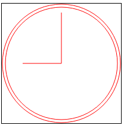

## 1. Canvas基本用法

使用 `<canvas>` 元素，必须先设置其 width 和 height 属性，指定可以绘图的区域大小。出现在开始和结束标签中的内容是后备信息，如果浏览器不支持 `<canvas>` 元素，就会显示这些信息。如果不任何样式或者不绘制任何图形，在页面中是看不到该元素的。

```
<canvas id="drawing" width="200px" height="200px">A drawing of something.</canvas>
```

要再 canvas 上绘图，需要取得绘图上下文。而取得绘图上下文对象的引用，需要调用 getContext() 方法并传入上下文的名字。传入 '2d'，上就可以取得 2D 上下文对象

- toDataURL() 方法可以取得在 `<canvas>`元素上绘制的图像。接受一个参数：图像的 MIME 类型格式，而且适用于创建图像的任何上下文，默认情况下值为 'image/png'，也可以传入 'image/jpg'

```
var drawing = docuement.getElementById('drawing');

// 确定浏览器支持<canvas>元素
if(drawing.getContext){
	var context = drawing.getContext('2d');

	// 显示图像
	var imgURL = drawing.toDataURL('image/png');

	var image = new Image();
	image.src = imgURL;
	document.body.appendChild(image);
}
```

> IE9+、Firefox 1.5+、Safari 2+、Opera 9+、Chrome、IOS 版 safari 以及 Android 版 Webkit 都在某种程度上支持 `<canvas>`

## 2. 2D 上下文

**2D 上下文的坐标开始于 `<canvas>` 元素的左上角，原点坐标是(0,0)。所有坐标值都是基于这个原点计算， x 值越大表示越靠右，y 值越大表示越靠下**

### 2.1. 填充和描边

2D 上下文的两种基本绘图操作是填充和描边。填充，用指定的样式（颜色、渐变或图像）填充图形；描边，只在图形的边缘画线。     
这两个操作的结果取决于两个属性：fillStyle 和 strokeStyle，这两个属性的值可以是字符串、渐变对象或模式对象，而且它们的默认值都是"#000000"。

***如果指定为字符串，可以使用 CSS 中指定颜色值的任何格式，包括颜色名、十六进制码、rgb、rgba、hsl 或 hsla***

### 2.2. 绘制矩形

- fillRect() 方法在画布上绘制的矩形会填充指定的颜色，填充的颜色通过 fillStyle 属性指定
- strokeRect() 方法在画布上绘制的矩形会使用指定的颜色描边，描边颜色通过 strokeStyle 属性指定
- clearRect() 方法用于清楚画布上的矩形区域，本质上，这个方法可以吧绘制上下文中的某一矩形区域变透明

**上面三个方法都接受4个参数：矩形的 x 坐标、矩形的 y 坐标、矩形的宽度和矩形的和高度，这些参数的单位都是像素**

2D 上下文还含有一下3个属性:

- lineWidth: 控制线条的宽度，值可以是任意整数
- lineCap: 控制线条末端的形状是平头、圆头还是方头（'butt'、'round'或'square'）
- lineJoin: 控制线条相交的方法是圆交、斜交还是斜接（'round'、'bevel'或'miter'）

```
<canvas width="100px" height="100px">A drawing of something.</canvas>

<script type="text/javascript">
var drawing0 = document.querySelectorAll('canvas')[0];
	if(drawing0.getContext){
		var context = drawing0.getContext('2d');

		context.fillStyle = '#ff0000';
		context.fillRect(10, 10, 50, 50);
		context.fillStyle = 'rgba(0, 0, 255, 0.5)';
		context.fillRect(30, 30, 50, 50);
		context.strokeStyle = 'rgba(0, 0, 255, 0.5)';
		context.strokeRect(50, 50, 50, 50);

		context.clearRect(40, 40, 10, 10);
	}
</script>
```


### 2.3. 绘制路径

- beginPath() 方法表示开始绘制新路径，要绘制路径必须调用该方法
- closePath() 方法表示把绘制路径的终点与起点连接起来
- fill() 方法表示绘制路劲完成后，填充它。在这方法之前需要使用 fillStyle 属性指定填充颜色
- stroke() 方法对路劲描边。调用这个方法之前需要使用 strokeStyle 属性指定描边的颜色
- clip() 方法在路劲上创建一个剪切区域
- isPointInPath(x, y) 方法用于在路劲被关闭之前确定画布上的(x, y)坐标是否在路劲上，返回布尔值

绘制路径的方法如下:      
- arc(x, y, radius, startAngle, endAngle, countercolockwise): 以(x, y)为圆心绘制一条弧线，弧线半径为 radius，起始和结束角度（用弧度表示）分别为 startAngle 和 endAngle。最后一个参数表示 startAngle 和 endAngle 是否按逆时针方向计算，值为 false 表示按顺时针方向计算
- arcTo(x1, y1, x2, y2, radius): 从上一点开始绘制一条弧线，到(x2, y2)位置，并且以给定的半径 radius 穿过(x1, y1)
- bezierCurveTo(c1x, c1y, c2x, c2y, x, y): 从上一点开始绘制一条曲线，到(x, y)为止，并且以(c1x, c1y)和(c2x, c2y) 为控制点
- lineTo(x, y): 从上一点开始绘制一条直线，到(x, y)为止
- moveTo(x, y): 将绘图游标移动到(x, y)，不画线
- quadraticCurveTo(cx, cy, x, y): 从上一点开始绘制一条二次曲线，到(x, y)为止，并且以(cx, cy)作为控制点
- rect(x, y, width, height): 从(x, y)开始绘制一个矩形，宽度和高度分别有 width 和 height 指定。这个方法绘制的是矩形路径，而不是 strokeRect() 和 fillRect() 所绘制的独立的形状

```
<canvas width="200px" height="200px">A drawing of something.</canvas>

<script type="text/javascript">
	var drawing0 = document.querySelectorAll('canvas')[0];
	if(drawing1.getContext){
		var context = drawing1.getContext('2d');

		context.beginPath();

		// 绘制外圆
		// context.lineTo(100, 100);
		// canvas 起始的坐标为中心，下面绘制的圆会把左边制动移动到，右边边框的中点上
		context.arc(100, 100, 99, 0, 2 * Math.PI, false);

		// 绘制内圆
		// 内圆需要把路径移动到内圆上的某一点，以避免绘制出多余的线条
		context.moveTo(194, 100);
		context.arc(100, 100, 94, 0, 2 * Math.PI, false);

		// 绘制分针
		context.moveTo(100, 100);
		context.lineTo(100, 15);

		// 绘制时针
		context.moveTo(100, 100);
		context.lineTo(35, 100);


		// context.lineTo(35, 100);
		// context.moveTo(0, 0);
		// context.arcTo(0, 10, 200, 0, 5);

		// context.lineWidth = '5';

		// context.lineCap = 'square';

		// context.lineJoin = 'bevel';

		// context.closePath();

		// 描边路径
		context.strokeStyle = 'red';
		context.stroke();

		if(context.isPointInPath(100, 100)){
			console.log('Point(100, 100) in the path');
		};
	}
}
</script>
```

